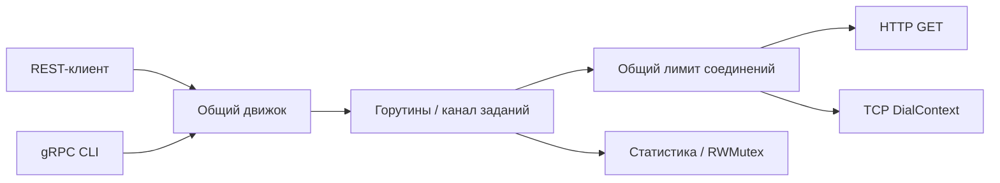

# Netprobe — конкурентные HTTP/TCP-проверки на Go

Сервис проверяет доступность настроенных адресов по запросу пользователя. Один движок доступен через REST и gRPC; консольный клиент демонстрирует настоящий вызов Protocol Buffers по HTTP/2.

**Стек:** Go 1.27.1, стандартная библиотека `net/http`, `net`, `context`, goroutines/channels, gRPC, Protocol Buffers, Docker, GitHub Actions.

## Что реализовано

- HTTP-проверка кода ответа и TCP-проверка установления соединения.
- Пул работников и общее ограничение сетевой параллельности для всех запросов.
- Ограничение числа активных пакетов: перегрузка возвращает `429` / `ResourceExhausted`.
- Таймаут каждой цели, общий дедлайн запроса и отмена через `context`.
- Сохранение порядка результатов независимо от порядка завершения проверок.
- Счётчики результатов в памяти под `sync.RWMutex`.
- Собственный `.proto`, сгенерированный сервер и типизированный CLI-клиент.
- Локальный демо-сервер: успешный HTTP, ошибка 503, медленный ответ, TCP-порт.
- Тесты сетевого поведения, конкуренции, перегрузки, отмены и gRPC-сериализации.



## Быстрый запуск в Docker

Нужен Docker Desktop с Linux-контейнерами. Из папки проекта:

```powershell
docker compose up --build -d --wait
.\scripts\demo.ps1
docker compose exec netprobe /probecli -address 127.0.0.1:9090 -targets demo-http,demo-tcp
```

REST доступен на `http://localhost:8082`, gRPC — `localhost:9092`. Порты опубликованы только на `127.0.0.1`. Демонстрационная цель работает в отдельном контейнере.

```powershell
docker compose logs netprobe
docker compose down
```

## Запуск без Docker

Нужен Go версии из `go.mod` или новее. База данных и Redis этому проекту не нужны.

В первом терминале:

```powershell
go run ./cmd/demo-target
```

Во втором:

```powershell
go run ./cmd/netprobe -config configs/targets.local.json -workers 4 -timeout 2s
```

В третьем:

```powershell
.\scripts\demo.ps1
go run ./cmd/probecli -targets demo-http,demo-tcp
```

Демо-сервер слушает `8085`. Если API уже запущен в Docker, остановите его перед нативным запуском, чтобы освободить порты.

## REST API

| Метод и путь | Назначение |
|---|---|
| `GET /healthz` | Доступность самого Netprobe |
| `GET /targets` | Разрешённые цели из конфигурации |
| `POST /checks` | Проверить выбранные цели; `{}` или пустой массив — все |
| `GET /stats` | Счётчики и последний завершившийся результат по каждой цели |

```powershell
$body = @{ target_ids = @('demo-http','demo-tcp','demo-failure','demo-timeout') } | ConvertTo-Json
Invoke-RestMethod http://localhost:8082/checks `
    -Method Post -ContentType 'application/json' -Body $body | ConvertTo-Json -Depth 5
```

Пример одного результата:

```json
{
  "target_id": "demo-http",
  "protocol": "http",
  "up": true,
  "latency_ms": 3,
  "status_code": 200
}
```

Фактическая задержка зависит от среды. `demo-http` и `demo-tcp` должны быть доступны, `demo-failure` вернёт `up: false` и код 503, `demo-timeout` завершится ошибкой примерно через 2 секунды. Эти два отрицательных результата предусмотрены демонстрацией.

Успешное выполнение пакета возвращает HTTP `200`, даже если отдельные цели недоступны. Неверные/повторяющиеся ID дают `400`, перегрузка — `429`, общий дедлайн — `504`. Размер JSON ограничен 16 КиБ. API принимает ID из конфигурации; адрес произвольной цели передать нельзя.

HTTP `2xx` и `3xx` считаются доступными; перенаправления не выполняются. Измеряется время до получения заголовков, тело ответа не анализируется. TCP проверяет только установление соединения: это не гарантирует исправность прикладного протокола.

## gRPC

Контракт: [api/probe/v1/probe.proto](api/probe/v1/probe.proto). Метод `probe.v1.ProbeService/Check` принимает `target_ids` и возвращает массив результатов.

```powershell
go run ./cmd/probecli -address 127.0.0.1:9092 -targets demo-http,demo-tcp -timeout 5s
```

Неизвестная цель даёт `InvalidArgument`, перегрузка — `ResourceExhausted`, отмена — `Canceled`, общий таймаут — `DeadlineExceeded`. Таймаут отдельной цели возвращается внутри её результата.

Сгенерированные `.pb.go` включены в `gen/`: `protoc` для запуска не нужен. Для изменения контракта установите `protoc 36.2`, затем из корня проекта выполните:

```powershell
.\scripts\generate.ps1
```

Скрипт устанавливает зафиксированные версии Go-плагинов и генерирует клиент/сервер. Изменения `.proto` и соответствующие `.pb.go` следует коммитить вместе.

## Конкуренция и ограничения

- По умолчанию разрешено 4 одновременных сетевых проверки **во всём процессе**, включая одновременные REST- и gRPC-запросы.
- Не более 8 активных пакетов; избыточные пакеты сразу отклоняются.
- В конфигурации 1–32 цели, в запросе не более 32 уникальных ID.
- Время одной проверки — 2 секунды по умолчанию; ожидание свободного сетевого слота ограничено дедлайном всего запроса.
- Максимальный дедлайн пакета — 15 секунд. Более короткий клиентский дедлайн имеет приоритет.
- Работники пишут результаты в разные индексы массива; после `WaitGroup.Wait()` массив читается обработчиком.
- Статистика защищена mutex и возвращается копией. Учитываются завершившиеся проверки; цель, не получившая слот до отмены, не увеличивает счётчик.

## Проверки

```powershell
go test -count=1 -v ./...
go vet ./...
go build ./...
```

Тесты не обращаются к внешним сайтам. HTTP/TCP-тесты используют временные локальные порты, gRPC-тест — `bufconn` с настоящим кодированием protobuf. Тест параллельных пакетов проверяет общий лимит, а тест отмены — освобождение слотов.

В GitHub Actions настроены `go test -race`, `go vet`, сборка и проверка Compose. Локальный `-race` требует поддерживаемого C-компилятора.

## Структура и учебные границы

`internal/probe` — правила и сетевые проверки; `internal/api` — два транспорта; `cmd/netprobe` — сервер; `cmd/probecli` — gRPC-клиент; `cmd/demo-target` — демо-цель. Пакет предметной логики не зависит от HTTP- или gRPC-обработчиков.

Проверки запускаются по запросу, фонового расписания нет. Статистика хранится в памяти и исчезает после перезапуска. Нет пользователей, TLS на входе и аутентификации gRPC: это локальная учебная конфигурация. Исходящие HTTPS-проверки проверяют сертификаты обычным способом. Демо-сервер нативно слушает `127.0.0.1:8085`; адрес можно задать через `DEMO_ADDR`. Конфигурацию целей меняет владелец сервиса, изменения требуют перезапуска.

Разбор для собеседования: [docs/interview.md](docs/interview.md).
